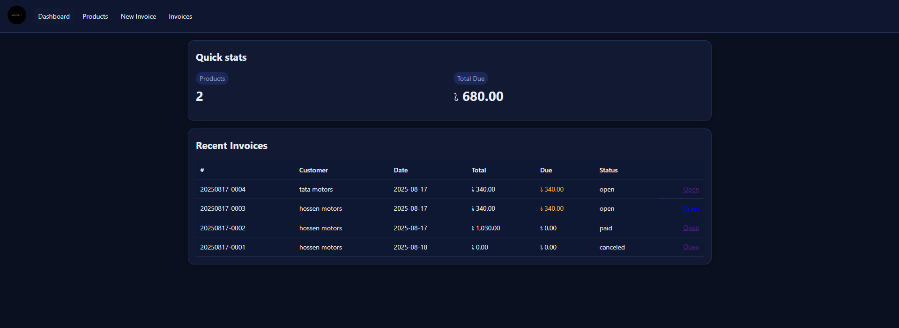
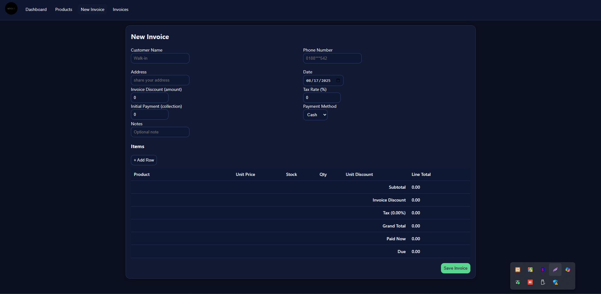
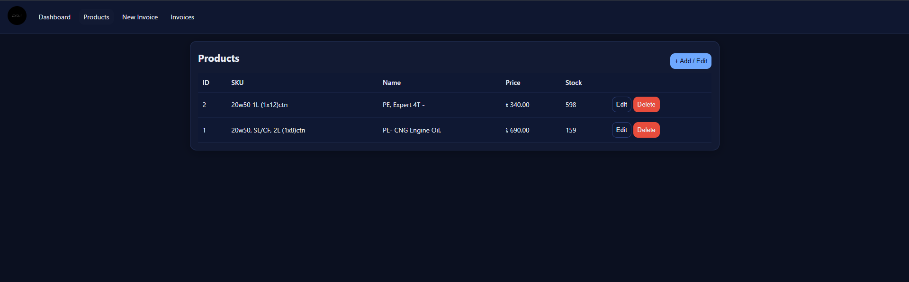
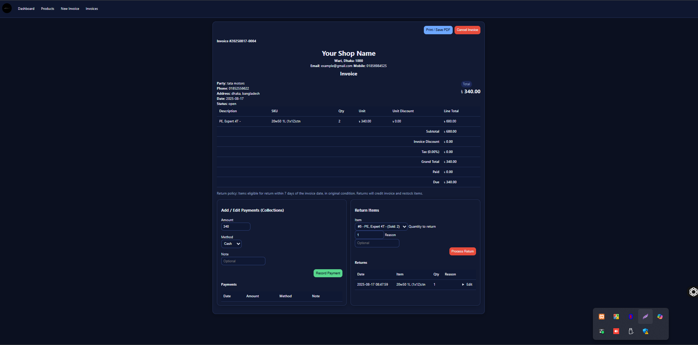

# 📄 Invoice & Inventory Web App (Single-file PHP)

A modern **single-file web application** built with **PHP, HTML, CSS,
and JavaScript** to manage **invoices, inventory, payments, and
returns**.\
The app uses **SQLite** by default (MySQL optional) and runs from a
single `invoice_app.php` file.

------------------------------------------------------------------------

## 🚀 Features

### Invoice Management

-   Create invoices with **multiple products**.
-   Each line supports **quantity, unit price, and unit discount**.
-   Calculates subtotal, discount, tax, and total automatically.
-   Invoice status: **Open, Paid, Canceled**.
-   Print-friendly view (use browser **Print → Save as PDF**).
-   Customer details: **Name, Phone, Address**.

### Inventory Management (CRUD)

-   Add, update, delete, and view products.
-   Product fields: **SKU, Name, Unit Price, Stock Quantity**.
-   Stock reduces when invoiced, increases on returns.
-   Low stock indicator.

### Payments (Collections)

-   Record payments (partial or full) against invoices.
-   Update and delete payments (CRUD).
-   View all payments with invoice balance tracking.

### Product Returns

-   Record product returns linked to invoices.
-   Stock automatically updated.
-   CRUD support for return records.
-   Add reason for return.

### CRUD Everywhere

-   Full create, read, update, delete for **Products, Invoices,
    Payments, Returns**.

------------------------------------------------------------------------
## 📸 Preview

### dashboard
 
### new invoice
 
### products
 
### invoice view & payment and return veiw
 


## 🛠️ Installation

### Steps

1. Clone the repository:
   ```bash
   git clone https://github.com/Level-R/invoice_app
   cd invoice_app
   ```
   
2.  Copy `invoice_app` into your PHP web server (e.g., `htdocs` for
    XAMPP, `www` for WAMP, `public_html` for hosting).

3.  Ensure the folder is writable (SQLite needs to create
    `data.sqlite`).

4.  Open in browser:

        http://localhost/invoice_app/invoice_app.php

5.  Add products → Create an invoice → Print or Save PDF.

------------------------------------------------------------------------

## ⚙️ Configuration

Inside `invoice_app.php` you can configure: - **BUSINESS_NAME** → Your
shop/organization name - **CURRENCY** → Default currency symbol (e.g.,
`$`, `€`, `৳`) - **TAX_RATE** → Default tax percentage (can be 0) -
**RETURN_WINDOW_DAYS** → Allowed product return days

------------------------------------------------------------------------

## 💾 Database

The app uses **SQLite** by default (`data.sqlite` auto-created).\
Tables: - `products` → SKU, name, price, stock\
- `invoices` → customer info, totals, status\
- `invoice_items` → product lines\
- `payments` → payments linked to invoices\
- `returns` → product returns

------------------------------------------------------------------------

## 📦 Export / Backup

-   Since SQLite is file-based, backup `data.sqlite` directly.\
-   Optional: Extend app with CSV Export/Import (products, invoices).

------------------------------------------------------------------------

## 📌 Notes

-   100% single-file app → no frameworks or external dependencies.\
-   Works on **PHP 7.4+** with SQLite enabled.\
-   Modern responsive UI with pure HTML/CSS/JS.

------------------------------------------------------------------------

## 🖨️ Printing Invoices

1.  Open an invoice.\
2.  Click **Print Invoice**.\
3.  In your browser print dialog → choose **Save as PDF** or a printer.

------------------------------------------------------------------------

## 👨‍💻 Author Info

**Developed by:** Abdur Rahman Roky

- 📧 Email: [abdurrahmanroky.bd@gmail.com](mailto:abdurrahmanroky.bd@gmail.com)
- 🐙 GitHub: [github.com/level-r](https://github.com/level-r)

Built with ❤️ by **Abdur Rahman Roky** as a lightweight ERP-style **Invoice +
Inventory Manager**.
